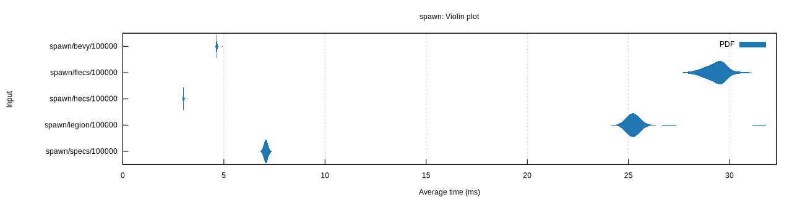
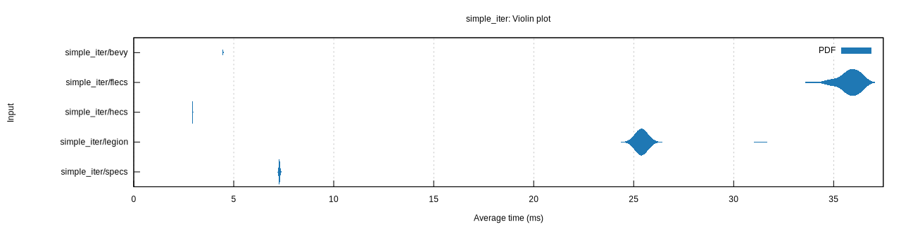
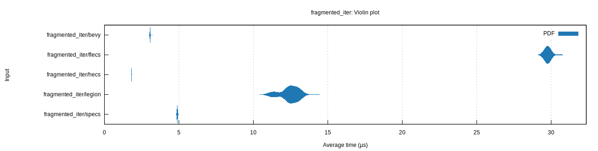
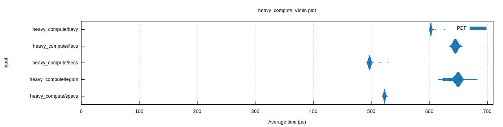

## Overview

This repository contains performance benchmarks comparing several Rust Entity-Component-System (ECS) libraries using [`Criterion`](https://crates.io/crates/criterion). We evaluate common operations across Bevy ECS, Hecs, Flecs ECS, Legion, and Specs to understand their relative strengths and trade-offs.

The five benchmark scenarios are:

1. **Spawn** – measuring raw entity creation cost (100,000 entities).
2. **Simple Iteration** – spawning entities with `Position` and `Velocity` and performing a simple update loop.
3. **Fragmented Iteration** – spawning a few types of components (`A`, `B`, `C`, `Data`) to simulate data fragmentation, then iterating over one component.
4. **Heavy Compute** – spawning entities with a `Transform` matrix and performing a CPU-heavy inner loop per entity.
5. **CRUD Add/Remove** – measuring the cost of adding and removing a component (`B`) on entities that already have another component (`A`).

Each section below embeds the violin plot generated by Criterion, highlighting the distribution of iteration times for that test.

---

## 1. Spawn Benchmark

Entities Created: **100,000**



This chart shows the distribution of times taken to spawn 100,000 entities for each ECS implementation.

---

## 2. Simple Iteration Benchmark

Operations:
- Spawn 100,000 entities with `Position` and `Velocity`.
- Iterate and update each `Position` by its corresponding `Velocity`.



---

## 3. Fragmented Iteration Benchmark

Setup:
- Spawn `FRAGMENTED_ENTITIES_PER_TYPE` entities per component type (`A`, `B`, `C`) each paired with `Data`.
- Iterate over all `Data` components and perform a simple multiplication.



---

## 4. Heavy Compute Benchmark

Setup:
- Spawn 1,000 entities with a 4×4 `Transform` matrix.
- Perform `HEAVY_COMPUTE_ITERATIONS` (100) inner-loop additions on the first element of the matrix.



---

## 5. CRUD Add/Remove Benchmark

Operations:
- Spawn 100,000 entities with component `A`.
- Add component `B` to each entity.
- Remove component `B` from each entity.


---

## Running the Benchmarks

Run all benchmarks with:
```sh
cargo bench
```

Results will appear in the `target/criterion` directory.
